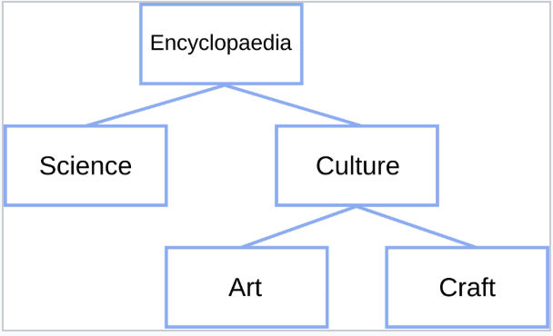
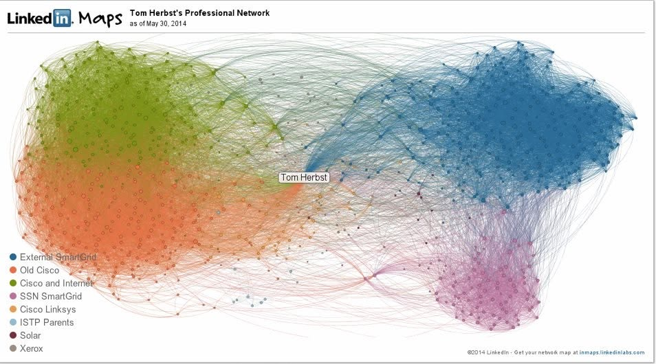
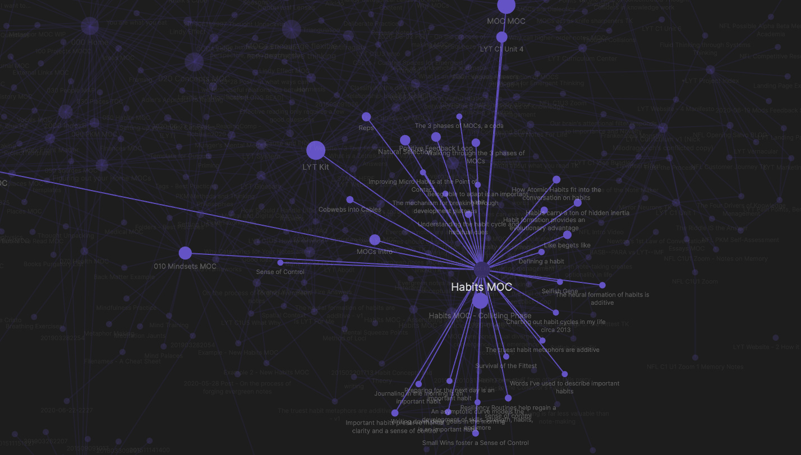
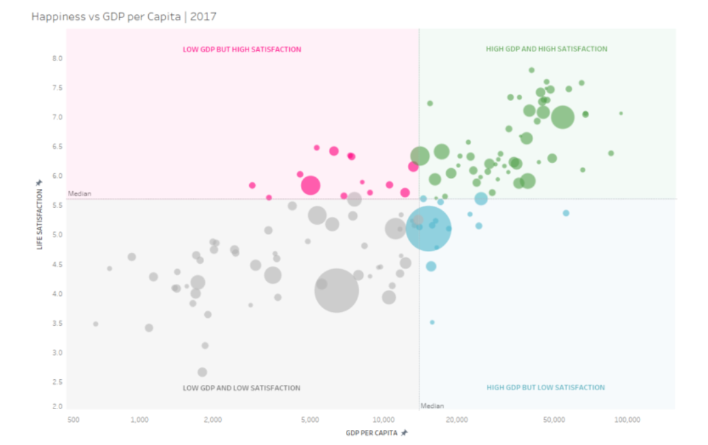
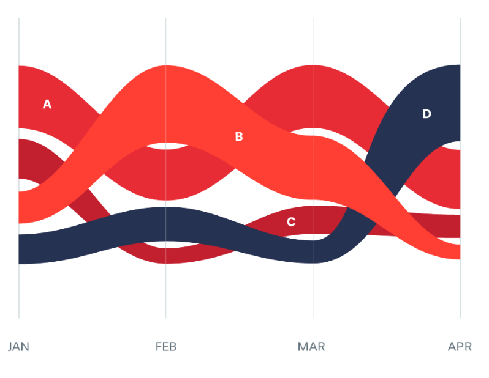
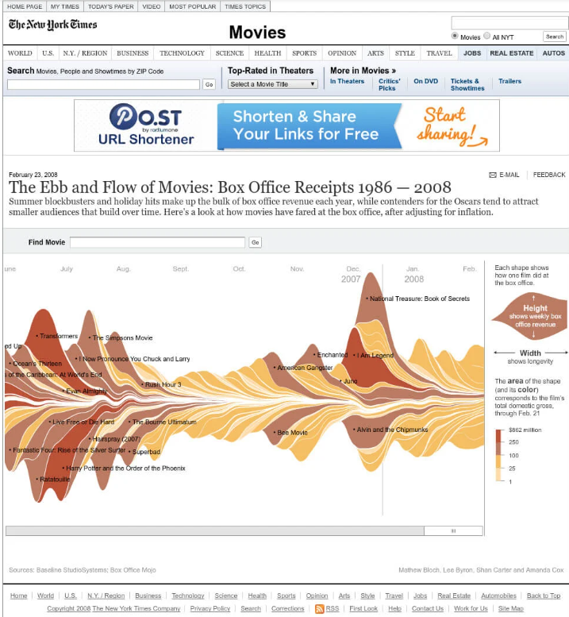
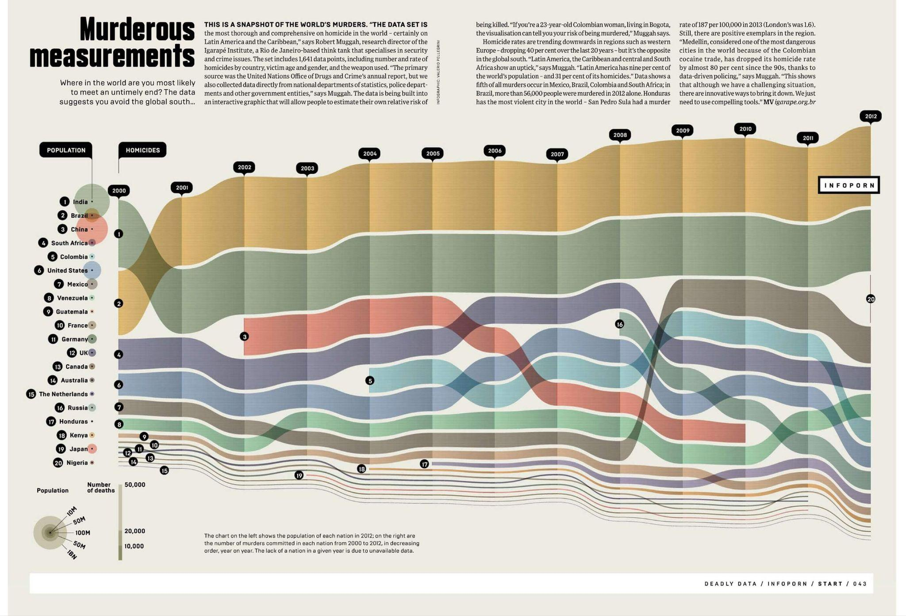
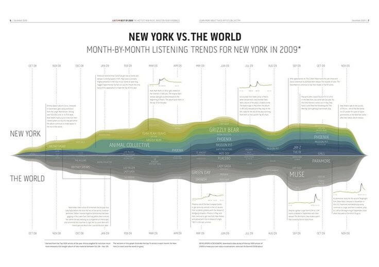
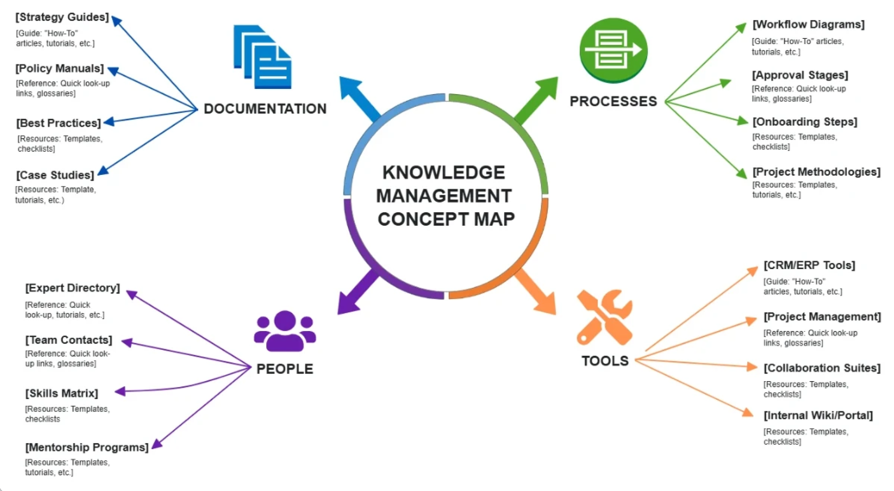

# Navigating Knowledge: An Interactive Exploration of Computing Concepts via Wikipedia’s Hyperlink Network and Reddit’s Discussion

**Group Members:** Christine Herbst, Ly Minh Ngoc (Audrey) Tran, Temuulen Enkhtamir

---

## 1. Topic, Goals, and Questions

Wikipedia provides a large, interconnected body of knowledge through hyperlinks between articles. However, for someone new to a field, the sheer number of connected concepts can make it difficult to understand **where to start, which concepts are foundational, and how different areas of the field relate to one another**. This project aims to transform Wikipedia from a collection of individual articles into an interactive **knowledge map that can guide beginners through a field**.

We focus on **computing and emerging technologies**, using a user-selected Wikipedia article as a starting point. Rather than treating the starting article as an isolated page, we follow its hyperlink structure to reveal how the topic branches into different areas, where branches reconnect, and which articles play important structural roles in the larger knowledge network. Reader attention, measured through Wikipedia pageviews, will provide an additional perspective on which concepts attract the most attention.

The intended audience is **new learners who want to develop an initial understanding of a computing or emerging-technology field**. The visualization is designed to support both guided exploration (starting from a topic and progressively discovering related concepts) and open-ended browsing, allowing users to follow connections that interest them.

**Our main visualization goals are to:**

- **Guide beginners** from a familiar starting concept toward related concepts at increasing levels of depth.

- **Reveal the structure of the field**, including branches, clusters, hubs, bridges, and reconnections.

- **Help users identify important concepts** based on network structure and reader attention.

- **Compare structural importance with popularity**, revealing concepts that are highly connected but receive relatively little attention, and vice versa.

- **Provide an optional real-world perspective** by comparing Wikipedia’s knowledge structure with concepts discussed in Reddit communities.

**Our questions are:**

1. How does a computing topic expand into different areas as we move farther from a starting Wikipedia article?

2. Which concepts play important structural roles within the knowledge network?

3. How are different areas of the field connected and where do apparently separate branches reconnect through shared articles?

4. Are structurally important articles also the articles that receive the most reader attention?

5. How does the popularity of concepts change over time?

6. How does Wikipedia’s representation of computing compare with what people discuss in online communities?

## 2. Dataset(s)

| Dataset | Source | Acquisition | Processing | Size | Key Attributes |
| --- | --- | --- | --- | --- | --- |
| English Wikipedia: Article & Hyperlink Network | English Wikipedia, accessed through the MediaWiki Action API. The **prop=links** module returns links from a specified page and supports pagination. Source: https://www.mediawiki.org/wiki/API:Links | We will use the MediaWiki Action API to retrieve internal links from a user-selected starting article. We will also use the API to download a subset of Wikipedia pages by category tag, using a shortlist of technology-related categories that we choose. | Python will clean article titles, resolve redirects, deduplicate nodes, calculate network measures, and export CSV or JSON files. Internal links will be transformed into an edge table connecting source and target article IDs. | The node table will contain approximately 5–7 variables per article. The number of articles and edges will depend on the selected technology-related categories and hyperlink depth. | Nodes: article ID, title, keywords, and other network-related attributes. Edges: source article ID and target article ID. |
| Wikimedia Pageviews | Wikimedia Analytics API, which provides pageview counts for individual Wikipedia articles. Source: https://doc.wikimedia.org/generated-data-platform/aqs/analytics-api/reference/page-views.html | We will use the Wikimedia Analytics API to obtain pageview counts for sampled Wikipedia articles. | Pageview data will be aggregated and joined with the Wikipedia node table by article title. Python will clean titles and ensure that pageview records correspond correctly to network articles. | Approximately one aggregated record per sampled article, with the exact number depending on the size of the Wikipedia network. | Article title, pageview count, and time-related pageview information (e.i. date/time period) used to examine reader attention and popularity trends. |
| Reddit Discussions | Reddit, accessed through the third-party SocialCrawl API: https://www.socialcrawl.dev/ | We will collect posts and comments from selected Reddit communities related to computing and emerging technologies, depending on the amount of data available through SocialCrawl. | Python will clean and preprocess text, identify computing and emerging-technology concepts, calculate concept frequency and co-occurrence, and compare the extracted concepts with those represented in Wikipedia. | Approximately a few thousand posts and comments, depending on API access and limits. Reddit will serve as a smaller supplementary dataset, rather than a comprehensive representation of online discussion. | Post/comment text, timestamp, subreddit, engagement information where available, and extracted concepts, frequencies, and co-occurrences. |

**Data Integration:**

The Wikipedia article and hyperlink network will serve as the primary dataset. Wikimedia pageviews will be joined to Wikipedia articles to compare structural importance with reader attention, while Reddit will provide a supplementary perspective on how computing and emerging-technology concepts are discussed in online communities. Rather than treating Reddit and Wikipedia as identical types of networks, we will compare them at the concept/topic level: Wikipedia represents relationships through article hyperlinks, while Reddit represents relationships through concepts that co-occur in discussions.

## 3. Analysis and Visualization Methods

We will use Python for API requests, data collection, data cleaning, preprocessing, and network analysis. The interactive website will be implemented with HTML, CSS, JavaScript, and . Python libraries such as Pandas will be used to process API data, while NetworkX will be used to construct the Wikipedia hyperlink network and calculate network measures. The visualizations will be coordinated so that selecting or filtering a concept in one view updates or highlights the same concept across other views.

| Visualization | Design Idiom | Analysis/Method | Purpose & RQ Addressed | Main User Tasks |
| --- | --- | --- | --- | --- |
| **1. Seed Article/Search View with Collapsible Hierarchical Tree** | Interactive search/entry view and hierarchical visualization | Accept a user-provided Wikipedia URL or article title and retrieve the selected article and its connected pages through the MediaWiki API. Use breadth-first search to calculate hyperlink distance from the seed article and organize related articles into levels. Display the top 10 most popular topics connected to the searched topic and the next top 10 topics connected to those topics. | Establishes the starting point for the learner's exploration. The selected seed determines the knowledge network analyzed in **RQ1–RQ6.** | Search, topic selection, exploration, starting-point selection, navigation, filtering by depth |
| **2. Force-Directed Knowledge Network** | Network/force-directed graph | Construct a directed graph with articles as nodes and hyperlinks as edges. Calculate degree, PageRank, betweenness centrality, and community/cluster structure. | Reveals hubs, bridges, clusters, cross-links, cycles, and reconnections. **RQ2, RQ3** | Exploration, relationship discovery, cluster identification, filtering, identifying important concepts |
| **3. Quadrant Scatterplot of Structural Importance and Popularity** | Multidimensional scatterplot with quadrant classification | Compare network measures such as degree or centrality with Wikipedia pageviews. Each point represents an article, with point size optionally representing another measure of structural importance. | Helps users identify concepts that are both structurally important and highly attended, as well as concepts that may be structurally important but overlooked, by comparing network importance with reader attention. **RQ2, RQ4** | Comparison, relationship discovery, outlier detection, filtering, identifying important or overlooked concepts |
| **4. Pageview Streamgraph** | Temporal/streamgraph visualization | Analyze time-series Wikipedia pageviews for selected concepts or topic groups. Users can select or filter concepts and compare their pageview trends across the chosen time period. | Shows how reader attention changes over time and helps identify concepts with emerging, declining, or sustained popularity. **RQ5** | Trend identification, temporal comparison, filtering, exploration |
| **5. Wikipedia–Reddit Comparative Streamgraph** | Mirrored temporal/streamgraph visualization | Analyze the popularity of selected computing concepts over time using Wikipedia pageviews and Reddit discussion data. Display Wikipedia trends above the central baseline and Reddit trends below it, using corresponding topic categories across both datasets. Normalize values within each source when necessary to enable comparison of relative trends. | Compares how interest in computing concepts changes over time across Wikipedia and Reddit. Reveals concepts that receive sustained attention in both sources, concepts that become prominent in one source earlier than the other, and differences between reader attention and online discussion. **RQ5, RQ6** | Temporal comparison, cross-platform comparison, trend identification, concept filtering, relationship discovery |
| **6. Real-World Job/Knowledge Connection** | Hierarchical concept map | Connect computing knowledge topics with real-world occupations. When users search for a job, display the knowledge topics most closely associated with that occupation; when users search for a knowledge topic, display the occupations most closely connected to it. | Connects important and popular computing concepts to real-world employment, helping users understand how knowledge areas relate to occupations and completing the user's exploration journey. | Search, exploration, relationship discovery, connecting concepts to real-world applications, career exploration |

## 4. Visualization Sketches or References (SUBJECT TO CHANGE)

The following initial sketches illustrate how the proposed visualizations may work together as an interactive knowledge map. The designs are preliminary and may be revised after examining the collected data.

There will be a global entry page, where users can click “Search knowledge” or “Search jobs.” Depending on which they click, Visualization 1 or 6 will be displayed first.

### 1. Seed Article/Search View with Collapsible Hierarchal Tree

- **Visualization technique:** Interactive search/entry view and Hierarchical visualization

- **Reference visualization**: A search bar connected to a collapsible tree, with the selected Wikipedia article as the root and related articles organized by hyperlink distance.

- **How it helps:** Shows how a starting topic branches into different areas as hyperlink distance increases, helping beginners progressively discover related concepts (RQ1).

- **Usage**: Users can search a topic/paste in a wikipedia link, which will then display the top-10 most popular topics connected to that topic, and the next top-10 topics connected to *those* topics. Searching in this search bar will also affect the map in Visualization #2. Users can expand or collapse branches and filter the tree by hyperlink depth.

### 2. Force-Directed Knowledge Network

- **Visualization technique:** Network/force-directed graph

- **Reference visualization:**

- **How it helps:** Reveals hubs, bridges, clusters, cross-links, and reconnections that are difficult to see in a simple hierarchy (RQ2–RQ3).

- **Usage**: Users can zoom, pan, click nodes, and highlight connected articles; node size can represent structural importance and colors can represent topic clusters.

### 3. Quadrant Scatterplot of Structural Importance and Popularity

- **Visualization technique**: Multidimensional scatterplot with quadrant classification

- **Reference visualization:** A four-quadrant scatterplot with structural importance on one axis and Wikipedia pageviews on the other; each point represents an article, with point size optionally representing another measure of structural importance

- **How it helps:** Helps users identify which concepts are both structurally important and highly attended, as well as those that may be important but overlooked, by comparing network importance with reader attention (RQ2, RQ4).

- **Interaction:** Users can filter by topic or network depth and hover over points to see the article title and its network/popularity measures.

### 4. Pageview Streamgraph

- **Visualization technique:** Temporal/streamgraph visualization

- **Reference visualization**: A streamgraph showing the pageview trends of selected concepts or topic groups across time.

- **How it helps:** Shows how reader attention changes over time and helps identify concepts with emerging, declining, or sustained popularity (RQ5).

- **Usage:** Users can select or filter concepts to compare their pageview trends over the chosen time period.

### 5. Wikipedia-Reddit Comparative Streamgraph

- **Visualization technique:** Mirrored temporal/streamgraph visualization

- **Reference visualization:**

- **How it helps:** Compares Wikipedia's representation of computing with concepts discussed in online communities, providing a supplementary perspective on current discussion (RQ6).

- **Interaction:** Users can filter by concept or subreddit and highlight concepts that appear in both Wikipedia and Reddit datasets or primarily in one.

### 6. Breakdown of connection to real-world

- **Visualization technique:** Hierarchical concept map

- **Reference visualization:** Existing concept-map example showing how a central knowledge area branches into related categories and concepts.

- **Usage:** If users select “Search Job” in the global entry page there will be a search bar displayed, and the visualization will display which knowledge topics are most closely associated with the searched job category. If the website is displaying the “Search Knowledge” side, then the visualization will display how the knowledge category searched connects to different jobs. After a user knows which topic is both popular and fundamentally important, we can display how these topics connect to the real world through employment by displaying how closely connected these topics are to real-world occupations. This completes the user journey.

## 5. Group Roles and Responsibilities

- **Christine Herbst** (Member 1): MediaWiki and Wikimedia API acquisition, data cleaning, and preparation of visualization-ready files

- **Temuulen Enkhtamir** (Member 2): social media crawling logic, and raw-data documentation, and preparation of visualization-ready files.

- **Audrey Ngoc Tran** (Member 3): interaction design, webpage layout, and visual styling.

- **All members:**  implementation, visualization design decisions, testing, interpretation, documentation, presentation preparation, and integration.

## 6. Interim Presentation Deliverables

By the interim presentation, we expect to have a working data-collection pipeline, a cleaned dataset, and preliminary network statistics. We will demonstrate the selected seed topic, explain our scope limits, and show initial exploratory findings such as the dataset size, overall keywords, and connections between wikipedia and social media. We also plan to present refined sketches for all five visualizations and working D3.js prototypes of at least a couple of them. Basic linked highlighting or filtering should also be demonstrated.

## 7. Timeline and Milestones

| Week | Milestone | Tasks | Responsible Member(s) | Expected Output |
|---|---|---|---|---|
| Week 2 | Project Definition  | Finalize seed topic, research questions, API strategy, and scope limits | All | Final proposal and data plan |
| Week 3 | Data Preparation | Collect links and pageviews; clean, deduplicate, and construct network | Christine & Temuulen | Clean nodes/edges datasets |
| Week 4 | Visualization Design | Calculate network metrics; refine five visualization designs; begin D3 prototypes | Temuulen & Audrey Ngoc | Analysis results and initial prototypes |
| Week 5 | Interim Prototype | Implement tree and force graph; add basic interaction; prepare interim presentation | All | Demonstrable interactive prototype |
| Week 6 | Implementation & Refinement | Build matrix, bar chart, and scatterplot; link interactions across views | All | Complete five-view interface |
| Week 7 | Final Integration | Test usability, fix bugs, improve styling, finalize documentation and presentation | All | Final website, repository, and presentation |
